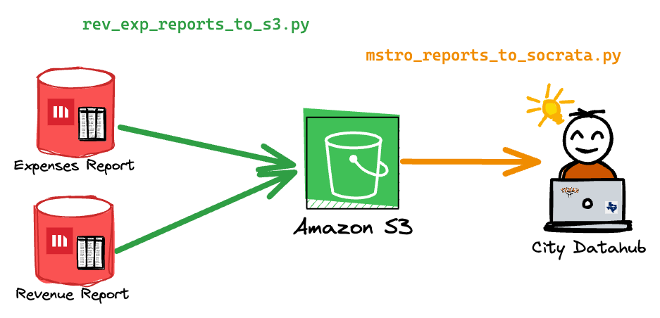

# TPW Finance Reporting

This repo stores python scripts that gathers financial reports from Microstrategy and parses them to publish data to the City Datahub.

## mstro_reports_to_socrata.py

This script downloads two finance reports (expenses and revenue) from microstrategy then uploads them as CSVs to an Amazon S3 bucket. Without any parameters, the script will download the report for the current month and the previous month. Each month's report is ran with the date set to the last date of the month. 

Download the report for the current month and previous month:

`$ python etl/mstro_reports_to_socrata.py`

Download the report for May 2024 & April 2024:

`$ python etl/mstro_reports_to_socrata.py --year 2024 --month 5`

## rev_exp_report_to_s3.py

This script downloads the CSVs stored in the S3 bucket, transforms the data, and upserts it to the City Data Hub (socrata). Similar to `mstro_reports_to_socrata.py`, it'll upload the current month and previous month's data without any script parameters.

Upsert the report for the current month:

`$ python etl/rev_exp_report_to_s3.py`

Upsert the report for May 2024:

`$ python etl/rev_exp_report_to_s3.py --year 2024 --month 5`

Replace all of the data in Socrata:

`$ python etl/rev_exp_report_to_s3.py --replace True`

## Docker

This repo can be used with a docker container. You can either build it yourself with:

`$ docker build . -t dts-finance-reporting:production`

or pull from our dockerhub account:

`$ docker pull atddocker/dts-finance-reporting:production`

Then, provide the environment variables described in env_template to the docker image:

`$ docker run -it --env-file env_file dts-finance-reporting:production /bin/bash` 

Then, provide the command you would like to run.